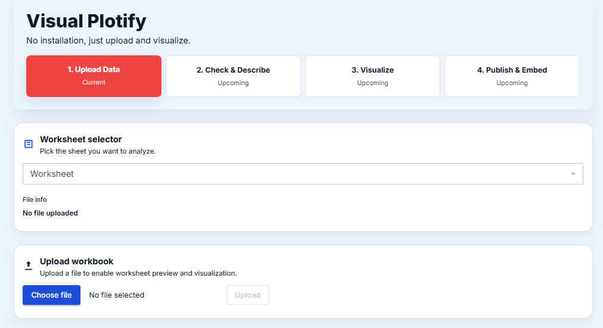
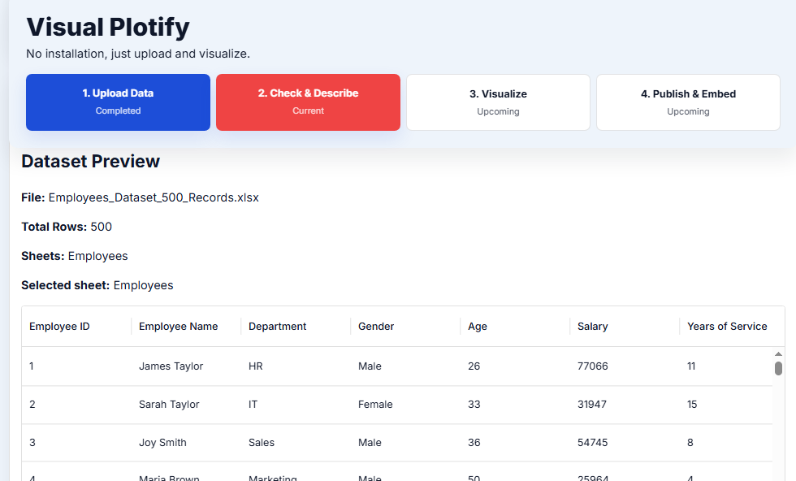
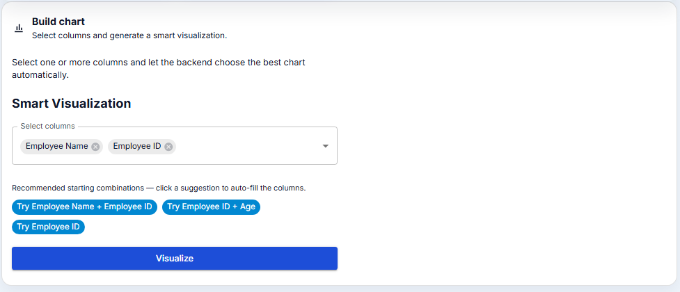
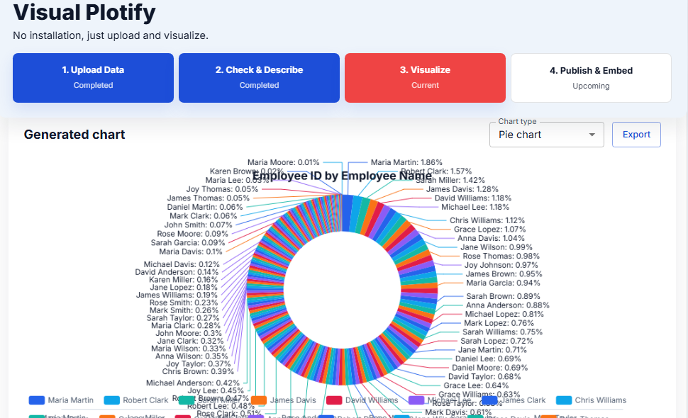

# Visual-Plotify
An offline desktop app that instantly turns Excel spreadsheets (.xlsx, .csv) into interactive charts, bar graphs, and visual dashboards. Built for speed and total data privacy—all computations and data parsing happen entirely on your local machine with zero cloud connectivity or internet required.

## Plug and Play Launch
Double-click `launch-visual-plotify.bat` from the project root to start the backend and frontend together, then open the app in your browser automatically.

### Screenshots:

#### Step 1

#### Step 2

#### Step 3

#### Step 4

### If this is your first time running the app
1. Install the backend dependencies:
   - `python -m venv backend\.venv`
   - `backend\.venv\Scripts\activate`
   - `pip install -r backend\requirements.txt`
2. Install the frontend dependencies:
   - `cd frontend`
   - `npm install`
3. Then double-click `launch-visual-plotify.bat`.

> After setup, you can also create a Windows shortcut to `launch-visual-plotify.bat` and place it on your desktop for true one-click access.
