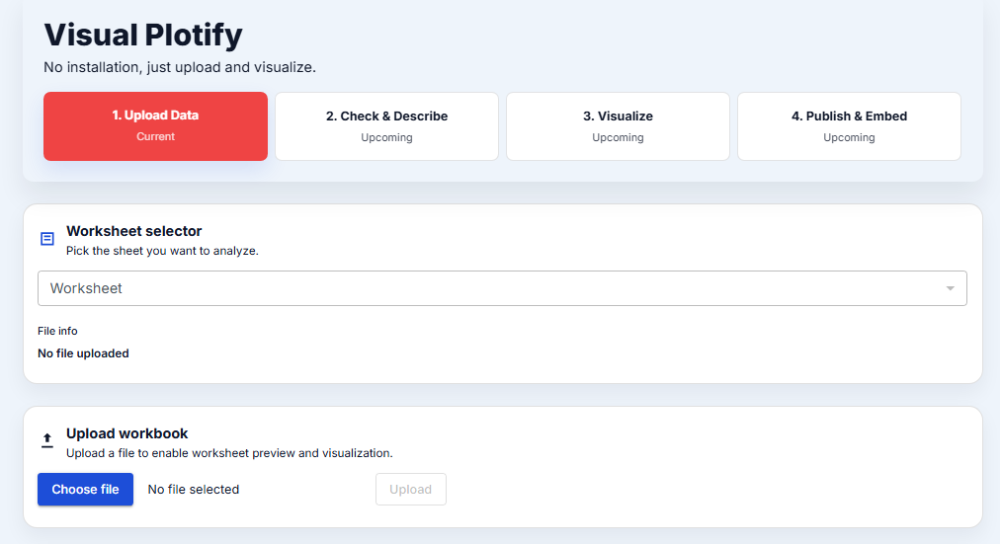
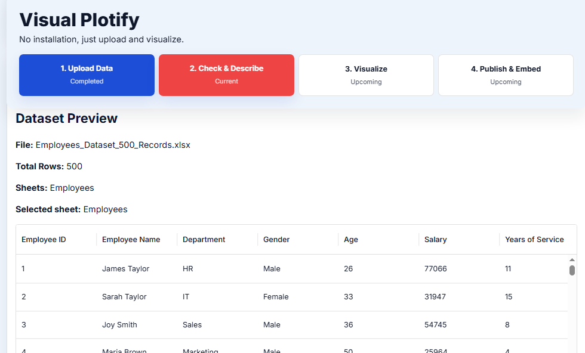
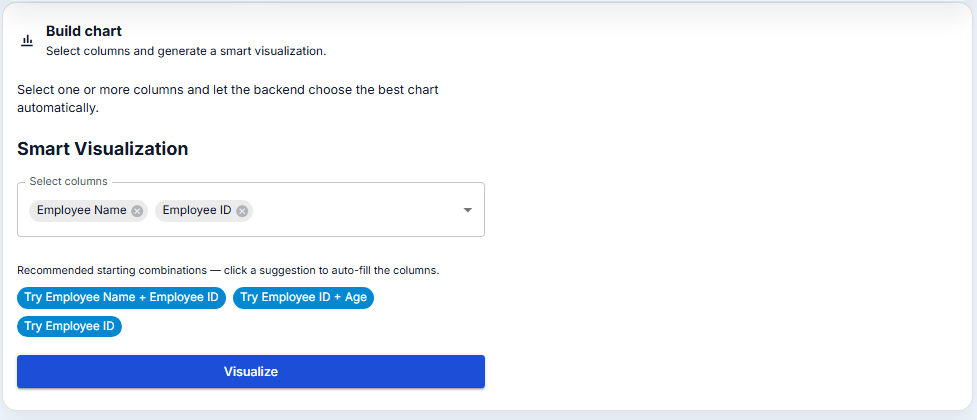
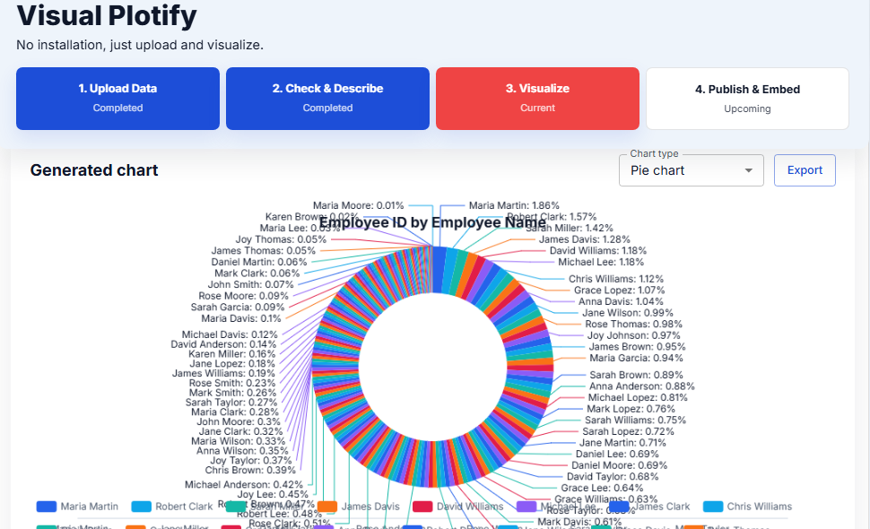

# Visual-Plotify
An offline desktop app that instantly turns Excel spreadsheets (.xlsx, .xlsm, .csv) into interactive charts, bar graphs, and visual dashboards. Built for speed and total data privacy—all computations and data parsing happen entirely on your local machine with zero cloud connectivity or internet required.

## What it does
- **Upload** — drag and drop an `.xlsx`, `.xlsm` or `.csv` file (25 MB limit), or start from a built-in sample dataset. Files never leave the machine and are stored under `backend/uploads`.
- **Profile** — a per-column profile with detected type (numeric, date, boolean, text), ranges, quartiles, top values, unique counts and missing-value bars, plus dataset-level quality (missing cells, duplicate rows, empty columns).
- **Preview** — a paginated, searchable data grid of the active worksheet, with a worksheet switcher for multi-sheet workbooks.
- **Chart** — the engine picks a sensible chart for the columns you pick (bar, horizontal bar, line, area, scatter, histogram, pie or donut) and you can override the type, aggregation (sum/average/median/min/max/count), ordering, top-N truncation and date bucketing.
- **Filter** — per-column rules (`equals`, `contains`, `between`, `greater than`, `is empty`, …) applied before the data is grouped.
- **Export** — PNG, JPEG, SVG, a paginated PDF, the chart data as CSV, or the full chart configuration as JSON. Every chart also has a data-table view for verification.
- **Comfortable to use** — a light/dark theme that follows your system preference, responsive layout, and a four-step progress rail (Upload → Explore → Build → Export).

Date-like text columns are detected and promoted to real dates, missing categories are labelled `Missing`, and long category tails are folded into an `Other` bar so charts stay readable.

## Plug and Play Launch
Double-click `launch-visual-plotify.bat` from the project root to start the backend and frontend together, then open the app in your browser automatically.

### Screenshots:

#### Step 1: Upload a spreadsheet


#### Step 2: Preview the uploaded file


#### Step 3: Choose column combinations


#### Step 4: Preview and select the chart of your choice


### If this is your first time running the app
1. Install the backend dependencies:
   - `python -m venv backend\.venv`
   - `backend\.venv\Scripts\activate`
   - `pip install -r backend\requirements.txt`
2. Install the frontend dependencies:
   - `cd frontend`
   - `npm install`
3. Then double-click `launch-visual-plotify.bat`.

> After setup, you can also create a Windows shortcut to `launch-visual-plotify.bat` and place it on your desktop for true one-click access.

## API
| Method | Path | Purpose |
| --- | --- | --- |
| `GET` | `/health` | Liveness, version and app name |
| `GET` | `/api/info` | API version, supported formats and limits |
| `POST` | `/upload/` | Upload a workbook or CSV, returns metadata, column statistics and a preview |
| `GET` | `/upload/preview` | Paged preview (`offset`, `limit`) of any worksheet |
| `GET` | `/upload/samples` | List the bundled sample datasets |
| `POST` | `/upload/samples/{id}` | Load a sample dataset |
| `POST` | `/chart/` | Build a chart from columns plus options and filters |

Interactive documentation is available at `http://127.0.0.1:8000/docs` while the backend is running. When `frontend/dist` exists, the backend also serves the built UI, so a single process is enough in production.

## Automated regression tests

The backend test suite creates its own temporary Excel workbooks and CSVs and covers the health check, secure uploads, metadata and column statistics, data quality, worksheet switching, paged previews, sample datasets, chart generation, request validation, upload-path containment, and each chart-selection strategy.

```powershell
python -m pip install -r backend\requirements-test.txt
python -m pytest backend\tests -q
```

## Browser end-to-end tests

The Playwright suite starts the frontend and API, uploads the included employee workbook, checks the preview, creates a chart, switches its type, and verifies PNG export.

```powershell
cd frontend
npm install
npx playwright install chromium
npm.cmd run test:e2e
```

## Frontend checks

```powershell
cd frontend
npm.cmd run lint
npm.cmd run build
```
